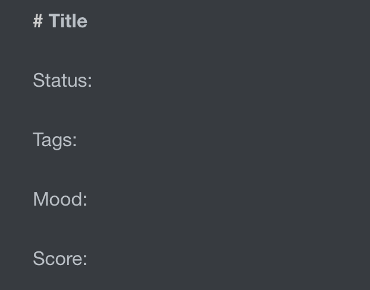
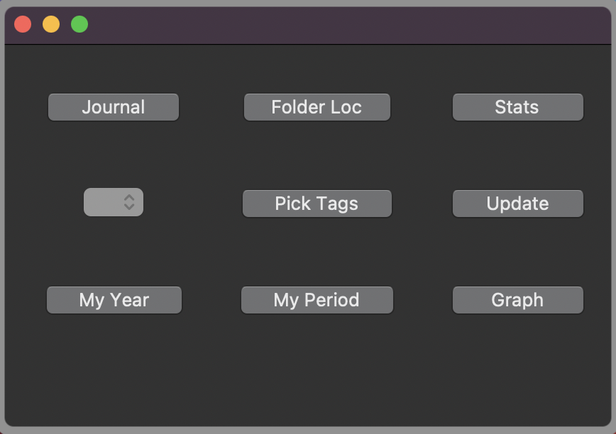

# GUI User Guide

The tool is set up for the following categorisations within each journal entry:

* Status (To allow journals to be filtered by different aspects of life ie: university, personal, work, ...)
* Tags (For searching similar themes)
* Daily words (I use these a highlevel overview of the day)
* Daily score (1-10 scoring system)

My template is set us as this:

The gui is basic, and looks like this:

Going through the 9 buttons as you read a book in English (left to right, top to bottom):

### Journal

Provides a callender popup (centred on today) for the user to select a day for the journal entry, once picked the user provides a title for the journal.

Journals are saved with the file name: yymmdd Title.md, where Title is defined by the user. 

Note that if a journal is made with the same title on the same day as an exisiting journal, an error message will apear and will require the user to rename the new journal.

### Folder Loc

Opens a file explorer in the current date's directory

### Stats

Presents a graph of how many journal entries have been made for each month

### Dropdown

Allows the user to toggle the Status, to filter down on selecting only certain types of journals.

### Pick Tags

Check boxes where the user can select certain tags and a combined markdown file is then made combining all journal entries with these tags.

### Update

Updates the json database where all data is stored.

### My Year

Produces a combined markdown file with all journal entries on this day in each year there are entires.

### My Period

Produces a combined markdown file with all journal entries within in the last x days (user defined).

### Graph

Produces a graph with a running average to visualise each journals daily score.

